# Análisis de Red con Wireshark: Captura y Análisis de Tráfico TCP/IP

---

## 📋 Índice

* [Objetivos](#Objetivos)
* [Topología de Red](#Topología-de-Red)
* [Configuración del Entorno](#Configuración-del-Entorno)
* [Prueba de Conectividad ICMP](#Prueba-de-Conectividad-ICMP)
* [Instalación de Wireshark](#Instalación-de-Wireshark)
* [Captura de Tráfico ICMP](#Captura-de-Tráfico-ICMP)
* [Análisis de Paquetes ICMP](#Análisis-de-Paquetes-ICMP)
* [Creación de un Servidor Web en Ubuntu](#Creación-de-un-Servidor-Web-en-Ubuntu)
* [Captura de Tráfico TCP](#Captura-de-Tráfico-TCP)
* [Three-Way Handshake TCP](#Three-Way-Handshake-TCP)
* [Análisis HTTP](#Análisis-HTTP)
* [Funcionamiento de la Pila TCP/IP](#funcionamiento-de-la-pila-tcpip)
* [Evidencias](#Evidencias)
* [Conclusiones](#Conclusiones)

# Objetivos

Este proyecto tiene como objetivo analizar cómo viajan los datos entre dos máquinas virtuales mediante la captura y análisis de paquetes utilizando Wireshark.

Se realizarán las siguientes pruebas:

1. Comunicación mediante ICMP (Ping).
2. Comunicación HTTP entre cliente y servidor.
3. Análisis de paquetes TCP/IP.
4. Estudio del Three-Way Handshake de TCP.
5. Análisis de peticiones y respuestas HTTP.

---

# Topología de Red

## Esquema

```Plaintext
┌─────────────────┐         Red Virtual        ┌─────────────────┐
│ Windows 11      │ <------------------------> │ Ubuntu Server   │
│ Cliente         │                            │ Servidor        │
│ 192.168.1.20    │                            │ 192.168.1.10    │
└─────────────────┘                            └─────────────────┘
```

---

# Configuración del Entorno

## Creación de las Máquinas Virtuales

### Máquina Cliente

- Sistema Operativo: Windows 11
- RAM: 6 GB
- Disco: 40 GB
- Adaptador de Red 1: NAT
- Adaptador de Red 2: Red Interna

### Máquina Servidor

- Sistema Operativo: Ubuntu
- RAM: 8 GB
- Disco: 50 GB
- Adaptador de Red 1: NAT
- Adaptador de Red 2: Red Interna

---
# Verificación de Direcciones IP

## Ubuntu

**Mostrar configuración de red:**

```bash
ip a
```

Sirve para mostrar todas las tarjetas de red de tu servidor y las direcciones IP que tienen asignadas.

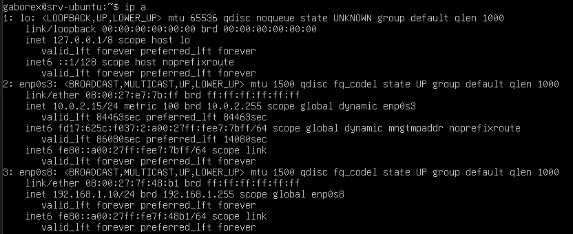

ó

```bash
hostname -I
```

Es la forma más rápida y directa de ver únicamente las direcciones IP privadas de tu servidor, sin mostrar ningún otro detalle técnico.

Resultado:

```Plaintext
10.0.2.15 192.168.1.10
```

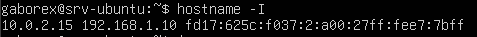

---

## Windows

Abrir CMD:

```cmd
ipconfig
```

Es la herramienta de Windows para saber cómo está conectada tu computadora a la red y así poder solucionar problemas de internet.
- Te da tu dirección IP
- Te dice la puerta de enlace

Resultado:

```Plaintext
IPv4 Address . . . . . : 192.168.1.20
```

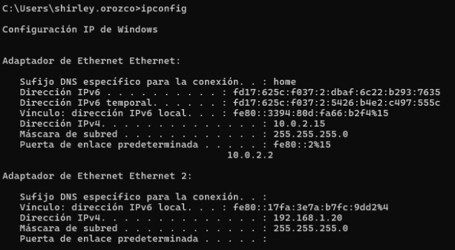

---
# Prueba de Conectividad ICMP

Desde Windows:

```cmd
ping 192.168.1.10 -n 4
```

Envía 4 señales al dispositivo que tenga la dirección IP 192.168.1.10 para comprobar si está encendido y conectado a tu red.

Resultado:

```text
Reply from 192.168.1.10:
bytes=32 time<1ms TTL=64
```

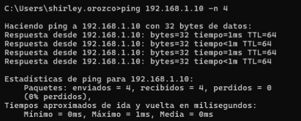

---
# Instalación de Wireshark

## Descarga

https://www.wireshark.org

Durante la instalación se seleccionó:

- Wireshark
- Npcap

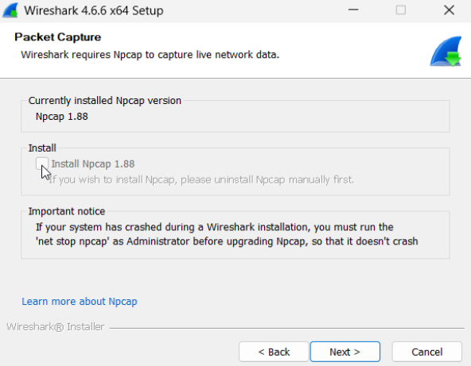


---
# Captura de Tráfico ICMP

## Inicio de Captura

1. Abrir Wireshark.
2. Seleccionar la interfaz de red **Ethernet 2**
3. Iniciar captura.

Filtro aplicado:

```Plaintext
icmp
```

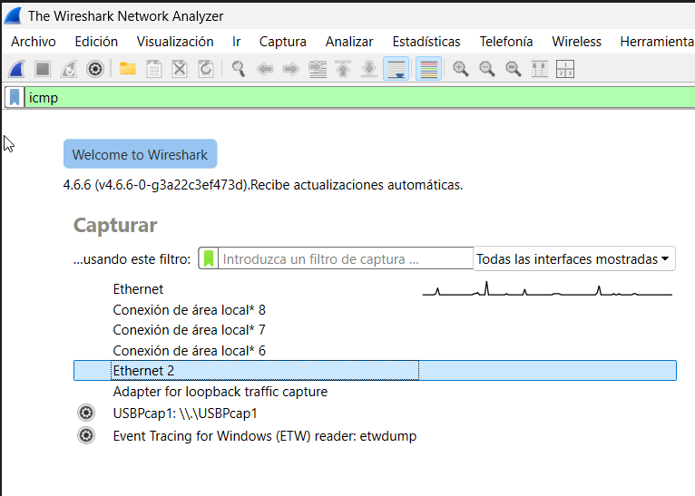

---
## Generación del Tráfico

Desde Windows:

```cmd
ping 192.168.1.10 -n 4
```


---
# Análisis de Paquetes ICMP

## Echo Request

Paquete enviado desde Windows hacia Ubuntu.

### Datos observados

| Campo       | Valor        |
| ----------- | ------------ |
| Origen      | 192.168.1.20 |
| Destino     | 192.168.1.10 |
| Tipo ICMP   | 8            |
| Descripción | Echo Request |
El cliente envía un mensaje ICMP al servidor.

## Echo Reply

Respuesta enviada por Ubuntu.

### Datos observados

| Campo       | Valor        |
| ----------- | ------------ |
| Origen      | 192.168.1.10 |
| Destino     | 192.168.1.20 |
| Tipo ICMP   | 0            |
| Descripción | Echo Reply   |
El servidor esta respondiendo a una solicitud de ping enviada previamente por el cliente.


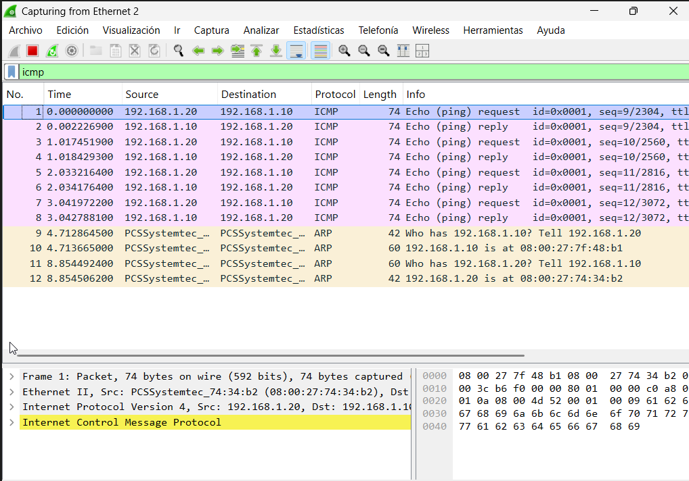

**Resumen:** El cliente (`192.168.1.20`) solicitó comunicarse con el servidor (`192.168.1.10`). Primero resolvieron sus direcciones físicas mediante el protocolo **ARP** y, acto seguido, el cliente evaluó la conectividad con el servidor mediante **4 ráfagas de paquetes ICMP (Ping)**. El servidor respondió con éxito al 100% de las peticiones en un tiempo de respuesta casi instantáneo (2 milisegundos), demostrando que **la red interna funciona perfectamente y el servidor está totalmente operativo**.

---
# Creación de un Servidor Web en Ubuntu

Ve a la dirección:

```bash
cd /var/www/html
```

Cambia de dirección y te traslada al directorio **html** desde la terminal de Ubuntu 

Crea el archivo:

```bash
nano index.html
```

Dentro del directorio **html** creamos el archivo index.html que contiene el contenido de la página Web.

Contenido:

```html
<!DOCTYPE html>
<html>
<head>
    <title>Proyecto Wireshark</title>
</head>
<body>
    <h1>Servidor Ubuntu funcionando</h1>
</body>
</html>
```

Guardar archivo y salimos del editor.

- Ctrl + O
- Enter
- Ctrl + X

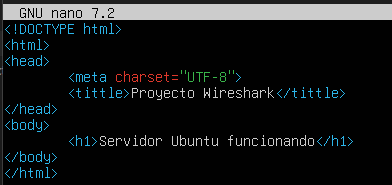

---

## Iniciar Servidor HTTP

```bash
python3 -m http.server 8000
```

Resultado:

```text
Serving HTTP on 0.0.0.0 port 8000
```


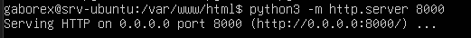

Nota: No cierres esta terminal

---
# Acceso desde Windows

Abrir navegador:

```text
http://192.168.1.10:8000
```

Resultado:

```text
Servidor Ubuntu funcionando
```

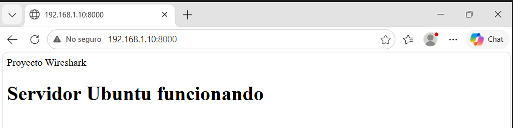

---

# Captura de Tráfico TCP

Aplicar filtro:

```text
tcp.port == 8000
```

Actualizar la página varias veces para generar tráfico.

---

# Three-Way Handshake TCP

TCP establece una conexión antes de transmitir datos.

## Paso 1 - SYN

Cliente → Servidor

```text
SYN
```

---

## Paso 2 - SYN ACK

Servidor → Cliente

```text
SYN, ACK
```

---

## Paso 3 - ACK

Cliente → Servidor

```text
ACK
```

### Datos observados

| Paso | Origen | Destino | Flags |
|--------|--------|--------|--------|
| 1 | 192.168.1.20 | 192.168.1.10 | SYN |
| 2 | 192.168.1.10 | 192.168.1.20 | SYN, ACK |
| 3 | 192.168.1.20 | 192.168.1.10 | ACK |

Nota: Tras la transferencia de datos HTTP se observó el cierre ordenado de la conexión mediante segmentos TCP con las banderas FIN y ACK.

---

# Análisis HTTP

Filtro aplicado:

```text
http
```

Si no aparecen resultados:

```text
tcp.port == 8000
```

---

## Petición HTTP GET

Ejemplo:

```http
GET / HTTP/1.1
Host: 192.168.1.10:8000
```

---

## Respuesta HTTP 304 Not Modified

Ejemplo:

```http
HTTP/1.0 304 Not Modified
Content-Type: text/html
```

Nota: El código HTTP 304 indica que el recurso solicitado no ha cambiado desde la última vez que fue descargado por el navegador. Gracias a ello, el cliente puede utilizar la copia almacenada en caché, reduciendo el tráfico de red y mejorando el rendimiento.


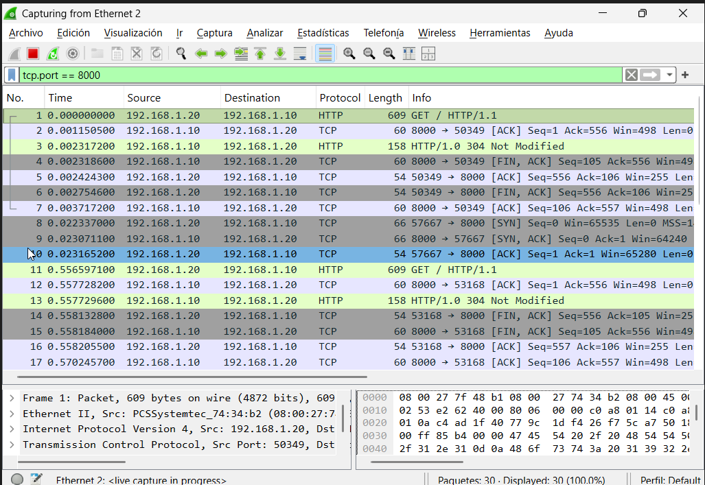


---

# Funcionamiento de la Pila TCP/IP

Durante la petición web se observa el proceso de encapsulación.

```text
Aplicación      → HTTP
Transporte      → TCP
Red             → IPv4
Enlace          → Ethernet
```

Representación:

```text
HTTP
 ↓
TCP
 ↓
IP
 ↓
Ethernet
```

---

# Evidencias

## Capturas realizadas

- [x] Configuración IP Windows
- [x] Configuración IP Ubuntu
- [x] Ping exitoso
- [x] Captura ICMP
- [x] Echo Request
- [x] Echo Reply
- [x] Servidor HTTP activo
- [x] Página web cargada
- [x] Three-Way Handshake
- [x] HTTP GET
- [x] HTTP 304 Not Modified
---

# Conclusiones

La práctica permitió analizar de forma práctica el funcionamiento de las comunicaciones TCP/IP entre un cliente Windows y un servidor Ubuntu dentro de una red virtual.

Mediante Wireshark se observaron las distintas fases de la comunicación, comenzando por la resolución ARP y la comprobación de conectividad mediante ICMP. Posteriormente se analizó el establecimiento de una conexión TCP a través del Three-Way Handshake y el intercambio de mensajes HTTP entre cliente y servidor.

Además, se comprobó el proceso de encapsulación de datos a través de las distintas capas de la pila TCP/IP, permitiendo comprender cómo se transporta una petición web desde la aplicación hasta el medio físico.

La práctica sirvió para familiarizarse con herramientas de análisis de red y para interpretar el tráfico real generado durante una comunicación cliente-servidor.

---
