# 🏢 Laboratorio de Active Directory - Controlador de Dominio

<p align="center">
  
  
  
  
</p>

---

# 📖 Descripción del Proyecto

Este proyecto consiste en la implementación de un entorno básico de dominio utilizando **Windows Server** y **Windows Cliente** en un laboratorio virtualizado con **VirtualBox**.

El objetivo principal es configurar un **Controlador de Dominio (Domain Controller)** con **Active Directory Domain Services (AD DS)** y unir un equipo cliente al dominio para gestionar usuarios y autenticación centralizada.

---

# 🎯 Objetivos del Proyecto

✅ Configurar un entorno de dominio básico  
✅ Instalar y configurar Active Directory  
✅ Configurar el servicio DNS  
✅ Crear Unidades Organizativas (OU)  
✅ Crear usuarios de dominio  
✅ Unir un cliente Windows al dominio  
✅ Validar autenticación y conectividad  

---

# 📑 Índice

- [🧩 1. Máquinas Virtuales](#-1-máquinas-virtuales)
- [🌐 2. Configuración de Red en VirtualBox](#-2-configuración-de-red-en-virtualbox)
- [🗺️ 3. Esquema de Red del Laboratorio](#️-3-esquema-de-red-del-laboratorio)
- [🖥️ 4. Configuración IP](#️-4-configuración-ip)
- [🏢 5. Instalación de Active Directory](#-5-instalación-de-active-directory)
- [🏛️ 6. Promoción a Controlador de Dominio](#️-6-promoción-a-controlador-de-dominio)
- [📂 7. Creación de OU](#-7-creación-de-ou-unidades-organizativas)
- [👤 8. Creación de Usuario de Dominio](#-8-creación-de-usuario-del-dominio)
- [🖥️ 9. Configuración del Cliente Windows](#️-9-configuración-del-cliente-windows)
- [🧪 10. Comprobaciones de Red](#-10-comprobaciones-de-red)
- [🏢 11. Unión del Cliente al Dominio](#-11-unión-del-cliente-al-dominio)
- [👤 12. Inicio de Sesión con Usuario AD](#-12-inicio-de-sesión-con-usuario-ad)
- [🧪 13. Comandos Utilizados](#-13-comandos-importantes-utilizados)
- [🔍 14. Validaciones del Dominio](#-14-validaciones-del-dominio)
- [🚀 15. Conclusiones](#-15-conclusiones)
---

# 🧩 1. Máquinas Virtuales

## 🖥️ Servidor

| Configuración     | Valor                  |
| ----------------- | ---------------------- |
| Sistema Operativo | Windows Server 2025    |
| Nombre del equipo | Windows-SRV            |
| Función           | Controlador de Dominio |

---

## 💻 Cliente

| Configuración     | Valor               |
| ----------------- | ------------------- |
| Sistema Operativo | Windows 11 Pro      |
| Nombre del equipo | Client-01           |
| Función           | Cliente del Dominio |

---

# 🌐 2. Configuración de Red en VirtualBox

## Configuración aplicada en ambas máquinas

Ruta:

```text
Configuración → Red
```

---

## 🖥️ Servidor (Windows-SRV)

| Adaptador   | Configuración            |
| ----------- | ------------------------ |
| Adaptador 1 | NAT                      |
| Adaptador 2 | Red Interna (`Red-Asir`) |

### Adaptador 1

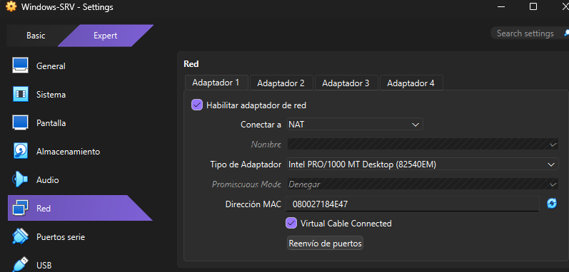

### Adaptador 2

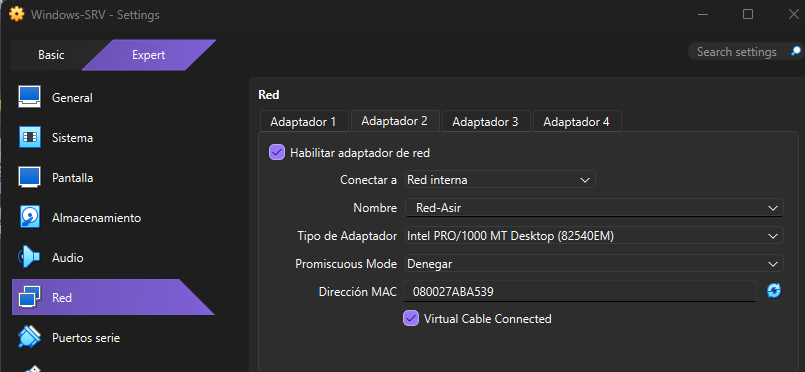

### Función

- NAT → Acceso a Internet
- Red Interna → Comunicación con el dominio

---

## 💻 Cliente (Client-01)

| Adaptador   | Configuración            |
| ----------- | ------------------------ |
| Adaptador 1 | Red Interna (`Red-Asir`) |

### Adaptador 1

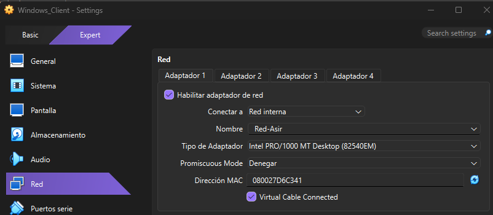

### Función

- Comunicación con el Controlador de Dominio

⚠️ Ambas máquinas deben utilizar EXACTAMENTE el mismo nombre de red.

---

# 🗺️ 3. Esquema de Red del Laboratorio

## Topología de Red

```text
                             INTERNET
                                 │
                             [ NAT ]
                                 │
                  ┌─────────────────────────┐
                  │      WINDOWS-SRV        │
                  │ Windows Server 2025     │
                  │ Controlador de Dominio  │
                  │ DNS + Active Directory  │
                  │                         │
                  │ IP: 192.168.1.10        │
                  │ DNS: 192.168.1.10       │
                  └─────────────────────────┘
                                 │
                     ─────── Red-Asir ───────
                                 │
                  ┌─────────────────────────┐
                  │        CLIENT-01        │
                  │     Windows 11 Pro      │
                  │ Cliente del Dominio     │
                  │                         │
                  │ IP: 192.168.1.20        │
                  │ DNS: 192.168.1.10       │
                  └─────────────────────────┘
```

---

## 📌 Descripción de la Arquitectura

| Adaptador | Función |
|---|---|
| NAT | Acceso a Internet |
| Red Interna (`Red-Asir`) | Comunicación privada del dominio |

---

# 🖥️ 4. Configuración IP

## 🔹 Servidor

```text
Abrir configuración -> Win + R
Escribe -> ncpa.cpl
Pulsa -> Enter

Identificar el adaptador interno
Ethernet (NAT)
Ethernet 2 (Red Interna)

Abrir propiedades
Click derecho sobre el adaptador de Red Interna -> Propiedades
Selecciona -> Protocolo de Internet Version 4 (TCP/IPv4) -> Propiedades

Configurar IP manual
Usar la siguiente dirección IP -> Rellena los datos como indica el cuadro de abajo

Guardar
Aceptar -> Cerrar
```

| Configuración     | Valor         |
| ----------------- | ------------- |
| Dirección IP      | 192.168.1.10  |
| Máscara de Subred | 255.255.255.0 |
| Puerta de Enlace  | Vacío         |
| DNS               | 192.168.1.10  |

### Abrir Configuración en Servidor -> Win + R

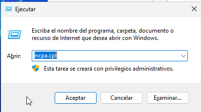

### Conexiones de Red -> Propiedades

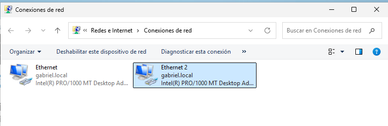

### Propiedades de Ethernet 2 -> Propiedades

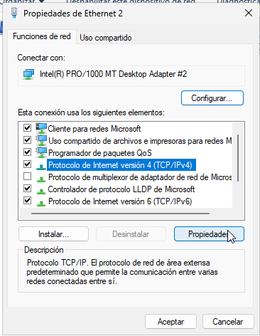

### Configuramos los datos IP, Máscara y DNS manualmente

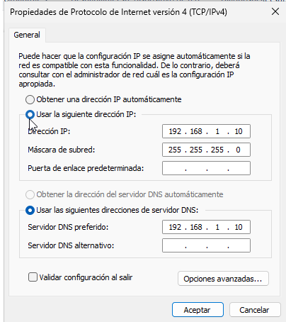

⚠️ El controlador de dominio debe tener IP fija.

---

## 🔹 Cliente

```text
Abrir configuración -> Win + R
Escribe -> ncpa.cpl
Pulsa -> Enter

Abrir propiedades del adaptador
Click derecho sobre el adaptador de Eternet(Red Interna) -> Propiedades
Selecciona -> Protocolo de Internet Version 4 (TCP/IPv4) -> Propiedades

Configurar IP manual
Usar la siguiente dirección IP -> Rellena los datos como indica el cuadro de abajo

Guardar
Aceptar -> Cerrar
```

| Configuración     | Valor         |
| ----------------- | ------------- |
| Dirección IP      | 192.168.1.20  |
| Máscara de Subred | 255.255.255.0 |
| Puerta de Enlace  | Vacío         |
| DNS               | 192.168.1.10  |

### Abrir Configuración en Cliente -> Win + R


### Conexiones de Red -> Propiedades

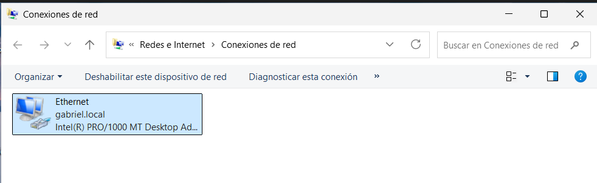


### Propiedades de Ethernet -> Propiedades

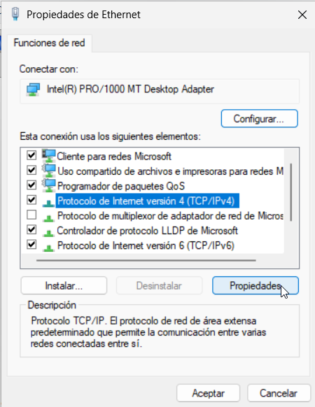

### Configuramos manualmente IP, Máscara y DNS

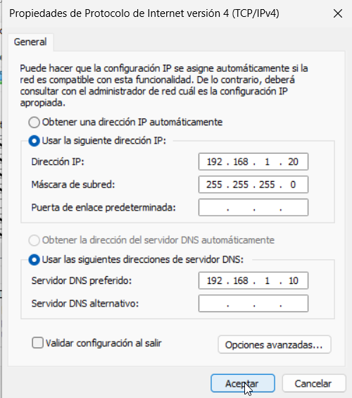


⚠️ El DNS del cliente debe apuntar al servidor.
⚠️ En este laboratorio no se configuró salida a Internet para el cliente,
por lo que no fue necesario definir una puerta de enlace.

---

# 🏢 5. Instalación de Active Directory

```text
Administrador del servidor → Agregar roles y características 
Seleccionar → Instalación basada en carácteristicas o roles → siguiente
Selecciona un servidor de la lista que aparece → siguiente
Marca la casilla → Servicios de dominio de Active Directory y Servidor DNS → pulsa varias veces "siguiente" 
Al final del todo → Click en Instalar
```

---

### Abrir Administrador del Servidor

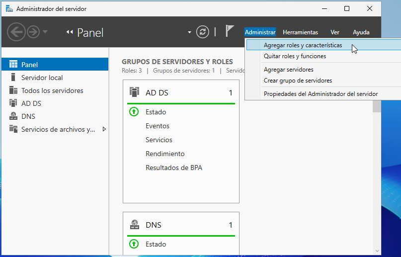

### Instalación basada en características o roles

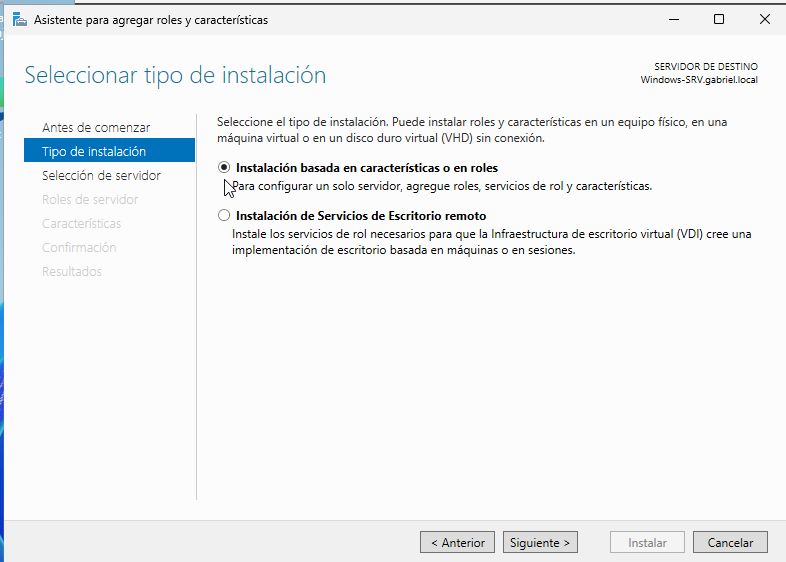

### Selecciona un Servidor

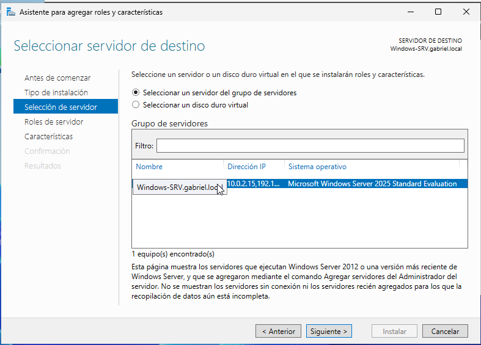

### Roles de Servidor -> Marca las casillas 

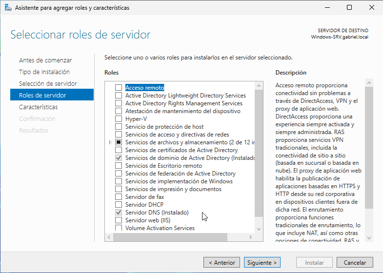

## Servicios instalados

✅ Active Directory Domain Services (AD DS)  
✅ DNS Server  

---

# 🏛️ 6. Promoción a Controlador de Dominio


```text
Cuando termine aparecerá arriba una banderilla amarilla
Pulsa → Promover este servidor a controlador de dominio
```
## Configuración utilizada

| Configuración | Valor         |
| ------------- | ------------- |
| Tipo          | Nuevo bosque  |
| Dominio       | gabriel.local |

---
### Promover Servidor

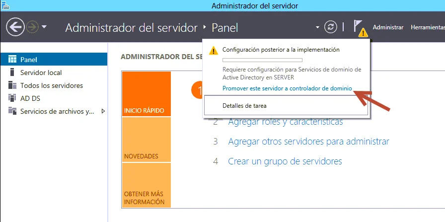

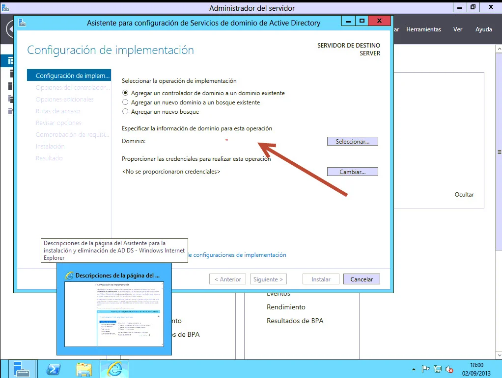

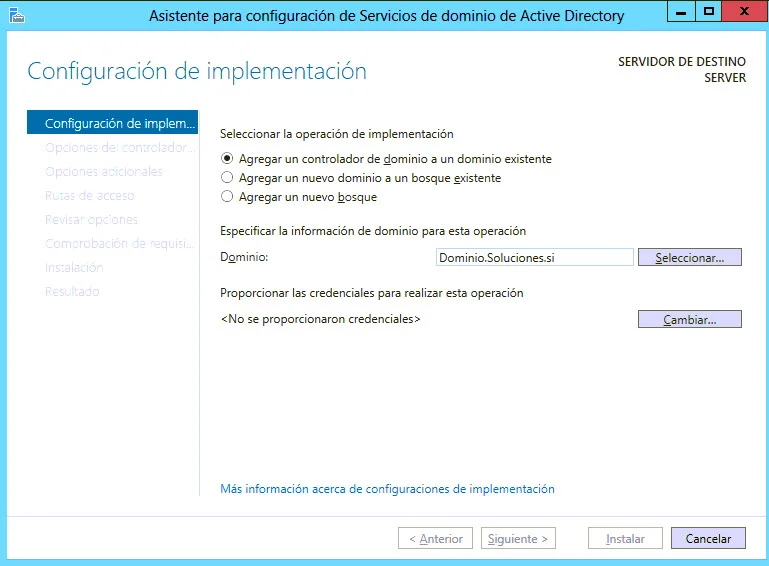

## Resultado

Después del reinicio automático:

✅ Active Directory configurado  
✅ DNS operativo  
✅ Controlador de Dominio funcional  

---

# 📂 7. Creación de OU (Unidades Organizativas)

## OU creadas

```text
Administrador del Servidor → Herramientas → Usuarios y Equipos de Active Directory ó desde win + R → dsa.msc

Haz click derecho sobre el dominio "gabriel.local"
Nuevo → Unidades Organizativas → Asignale un Nombre Ej:(Proyecto-Asir) ésta será nuestra OU principal
Marca la opción → Proteger contenedor contra eliminación accidental
Aceptar

Luego dentro de Proyecto-Asir crearemos Usuarios, Equipos, Administración, etc...
Nota: Repite el proceso para crear más OU dentro de la OU Principal (Usuarios, Equipos, Administración)
```


| OU             | Función                |
| -------------- | ---------------------- |
| Usuarios       | Gestión de usuarios    |
| Equipos        | Gestión de equipos     |
| Administración | Gestión administrativa |
### Abrir Administrador del Servidor -> Win + R

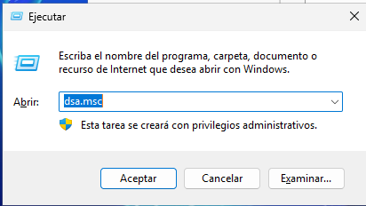

### Nueva Unidad Organizativa

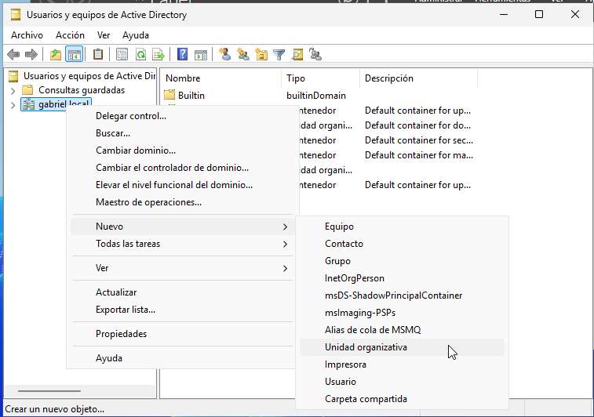

### OU Principal

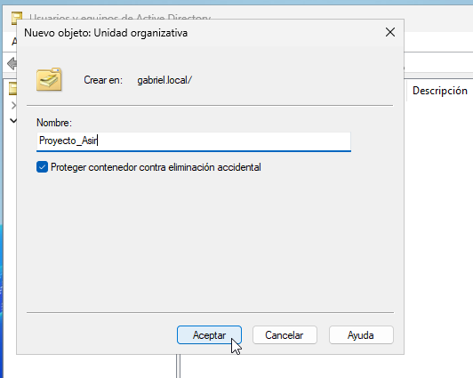

⚠️ Se repiten los mimos pasos una vez creada la OU principal (dentro de ésta elaboraremos Usuarios, Equipos, Administración. . .)

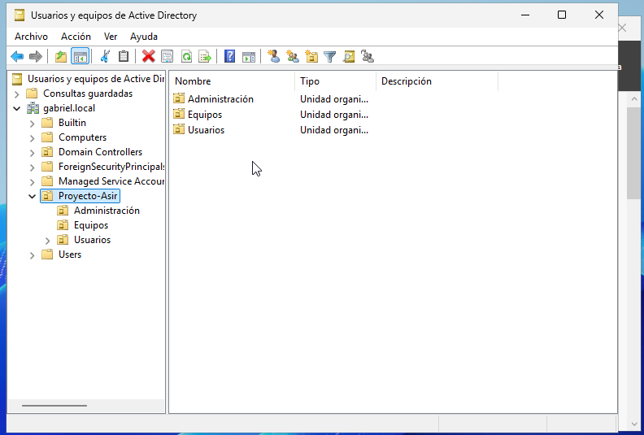

---

# 👤 8. Creación de Usuario del Dominio

```text
Una vez creado la OU de Usuario sobre esa carpeta click derecho → Nuevo → Usuario
Rellenar los datos del usuario → siguiente
Aplicar contraseña de inicio → aceptar
```

## Datos configurados

| Campo      | Valor          |
| ---------- | -------------- |
| Nombre     | Shirley Orozco |
| Usuario    | shirley.orozco |
| Contraseña | Asir1234!      |

### Crear Usuario

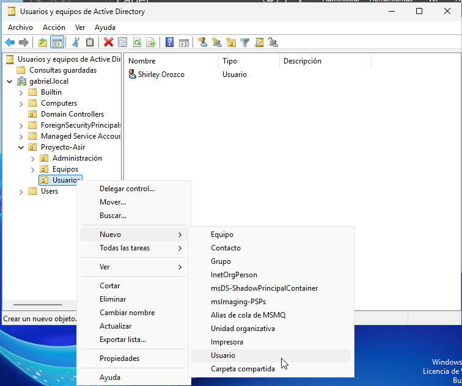

### Rellenamos los datos

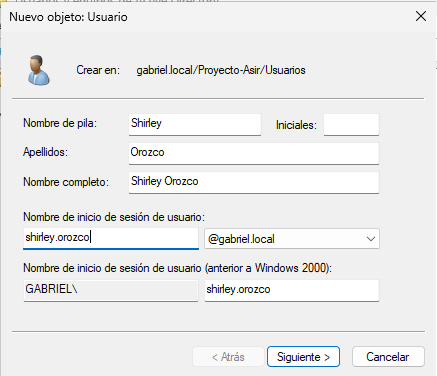

### Aplicamos una contraseña de sesión

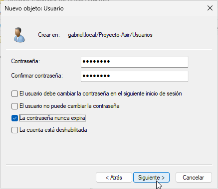

### Click en Siguiente y Finalizar

---

# 🖥️ 9. Configuración del Cliente Windows

```text
En la máquina cliente hacemos Win + R 
Escribimos → sysdm.cpl

En Propiedades del Sistema → En la pestaña "Nombre de Equipo" → Cambiar
Escribimos el nombre del equipo
```

## Nombre configurado

```text
Pc-Client01
```

### Máquina Cliente Abrimos

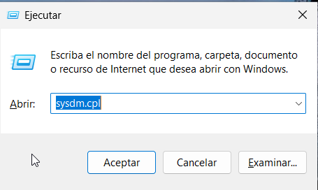

### Nos pedirá Acceso como Administrador

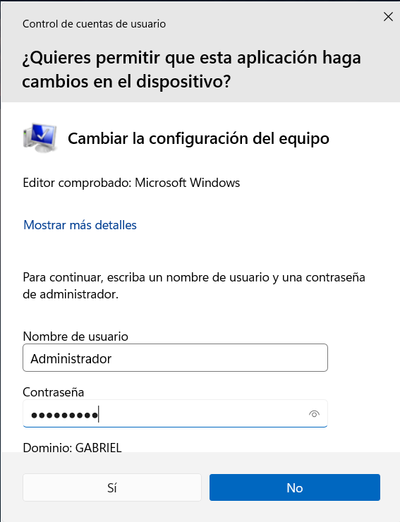

### Propiedades del Equipo -> Cambiar. . .

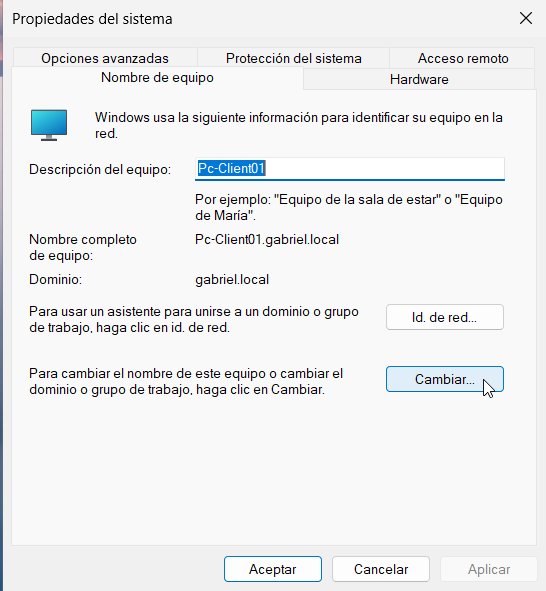


---

# 🧪 10. Comprobaciones de Red

## Verificar conectividad

```powershell
ping 192.168.1.10
```

---

## Verificar resolución DNS

```powershell
nslookup gabriel.local
```

---

# 🏢 11. Unión del Cliente al Dominio


```text
Configuración
→ Sistema
→ Acerca de
→ Cambiar configuración
→ Cambiar

Nota: Ó también se puede hacer la misma configuración con Win + R y escribimos sysdm.cpl

Propiedades del sistema → Nombre del equipo

Allí podrás:
→ Cambiar Nombre del Equipo
→ Unir el equipo al dominio
→ Pasar de grupo de trabajo a dominio
```

---

### Abrimos


### Propiedades del Sistema -> Cambiar . . .


### Cambiamos dominio

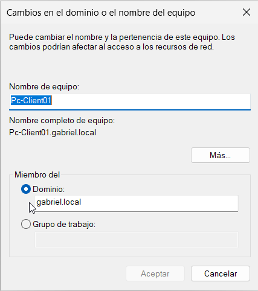


## Configuración aplicada

```text
Dominio: gabriel.local
```

---

## Credenciales utilizadas

```text
gabriel\Administrador
```

---

## Resultado esperado

```text
Bienvenido al dominio gabriel.local
```

---

# 👤 12. Inicio de Sesión con Usuario AD

## Usuario utilizado

```text
gabriel\shirley.orozco
```

---

### Inicio de Sesión


## Resultado esperado

Inicio de sesión exitoso utilizando credenciales del dominio.

---

# 🧪 13. Comandos Importantes Utilizados

## Ver configuración IP

```powershell
ipconfig /all
```

---

## Ver nombre del equipo

```powershell
hostname
```

---

## Ver usuario conectado

```powershell
whoami
```

---

## Ver dominio del equipo

```powershell
systeminfo | findstr /C:"Dominio"
```

---

## Limpiar caché DNS

```powershell
ipconfig /flushdns
```

---

## Ver controlador autenticado

```powershell
$env:LOGONSERVER
```

### Resultado esperado

```text
\\WINDOWS-SRV
```

---

## Ver usuarios del dominio

```powershell
net user /domain
```

---

# 🔍 14. Validaciones del Dominio

Una vez configurado el entorno de Active Directory se realizaron diferentes comprobaciones para verificar el correcto funcionamiento del dominio, DNS y autenticación.

---

# 🖥️ Validación del Controlador de Dominio

## Ejecutar diagnóstico del DC

```powershell
dcdiag
```

## Resultado esperado

```text
passed test
```

✅ Verifica:

- Servicios de Active Directory
- DNS
- Replicación
- Conectividad
- Estado general del DC

---

# 👥 Validar usuarios del dominio

## Mostrar usuarios existentes en Active Directory

```powershell
Get-ADUser -Filter *
```

## Resultado esperado

Listado de usuarios del dominio:

```text
AdministradorGuestshirley.orozco
```

⚠️ En caso de error importar primero el módulo:

```powershell
Import-Module ActiveDirectory
```

---

# 🌐 Validación DNS desde Cliente

## Verificar resolución DNS del dominio

```powershell
nslookup gabriel.local
```

## Resultado esperado

```text
Servidor:  windows-srv.gabriel.localAddress:   192.168.1.10
```

✅ Confirma que el cliente utiliza correctamente el DNS del controlador de dominio.

---

# 🏢 Validación del Controlador de Dominio desde Cliente

## Identificar el DC autenticado

```powershell
nltest /dsgetdc:gabriel.local
```

## Resultado esperado

```text
DC: \\WINDOWS-SRVAddress: \\192.168.1.10Dom Name: gabriel.local
```

✅ Verifica que el cliente encuentra correctamente el controlador de dominio.

---

# 👤 Validar sesión de usuario del dominio

## Verificar usuario autenticado

```powershell
whoami
```

## Resultado esperado

```text
gabriel\shirley.orozco
```

✅ Confirma autenticación mediante Active Directory.

---

# 🖥️ Validar dominio del equipo

## Consultar dominio asociado

```powershell
systeminfo | findstr /C:"Dominio"
```

## Resultado esperado

```text
Dominio: gabriel.local
```

✅ Confirma que el equipo pertenece al dominio.

---

# 📡 Validar conectividad con el servidor

## Probar comunicación con el DC

```powershell
ping 192.168.1.10
```

## Resultado esperado

```text
Respuesta desde 192.168.1.10
```

✅ Verifica conectividad entre cliente y servidor.

---

# ✅ Resultado Final de Validaciones

| Verificación                  | Estado      |
| ----------------------------- | ----------- |
| Active Directory              | ✅ Correcto  |
| DNS                           | ✅ Operativo |
| Cliente unido al dominio      | ✅ Correcto  |
| Autenticación AD              | ✅ Funcional |
| Resolución de nombres         | ✅ Correcta  |
| Comunicación Cliente-Servidor | ✅ Exitosa   |

# 15. 🚀 Conclusiones

Durante este laboratorio se logró implementar correctamente un entorno básico de Active Directory utilizando Windows Server y VirtualBox.

Se configuró un controlador de dominio funcional, se gestionaron usuarios y unidades organizativas, y se realizó la unión exitosa de un cliente Windows al dominio.

---

## 📚 Conocimientos reforzados

- Administración de Windows Server
- Active Directory
- DNS
- Redes
- PowerShell
- Gestión de usuarios y equipos
- Resolución de problemas

---

# 👨‍💻 Autor

## Gabriel Orozco

📌 Estudiante de Infraestructura IT y Ciberseguridad

### GitHub

```text
https://github.com/franklinamador725-droid
```

### LinkedIn

```text
https://www.linkedin.com/in/gabriel-orozco-300879235
```
