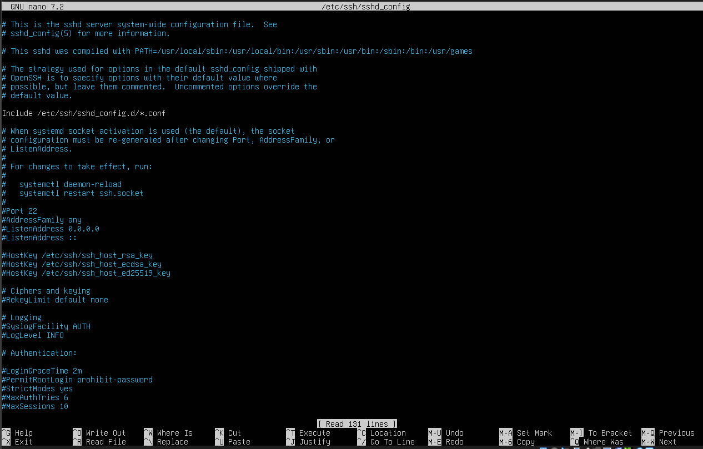
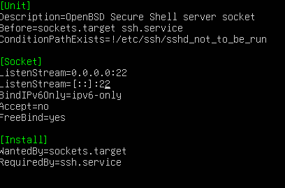

# 🔐 Hardening Ubuntu Server en VirtualBox

Securizar un servidor Ubuntu, 
dejándolo accesible **solo por SSH**, 
con **puerto personalizado** y **firewall activo**.

---

## 📋 Índice

1. [Requisitos previos](#-1-requisitos-previos)
2. [Comprobación inicial](#-2-comprobación-inicial)
3. [Actualización del sistema](#-3-actualización-del-sistema)
4. [Configuración SSH](#-4-configuración-ssh)
5. [Solución al error de cambio de puerto (Systemd Sockets)](#-5-solución-al-error-de-cambio-de-puerto-systemd-sockets)
6. [Configuración del Firewall (UFW)](#-6-configuración-del-firewall-ufw)
7. [Cerrar otros accesos](#-7-cerrar-otros-accesos)
8. [Probar acceso SSH](#-8-probar-acceso-ssh)
9. [Trabajos realizados](#-9-trabajos-realizados)
    
---

## 🧰 1. Requisitos previos

- Ubuntu Server 22.04 / 24.04 LTS  
- VirtualBox  
- Red en modo puente (Bridge) o similar  
- Acceso inicial al servidor  

---

## 🧪 2. Comprobación inicial 

(Configuración de red y Conectividad a Internet)

Se verifica que el sistema tiene conectividad de red y acceso 
a Internet antes de aplicar configuraciones de seguridad.

```bash
ip a
ping 8.8.8.8
```

## 📦 3. Actualización del sistema

```bash
sudo apt update && sudo apt upgrade -y
```

## 🔐 4. Configuración SSH
(Editar configuración)

```bash
sudo nano /etc/ssh/sshd_config
```




### Cambiar puerto
Busca:
```bash
#Port 22
```
Y cámbialo por:
```bash
Port 2222
```

### Desactivar acceso root
Busca:
```bash
#PermitRootLogin prohibit-password
```
Cámbialo por:
```bash
PermitRootLogin no
```

### Autenticación por contraseña
Busca:
```bash
# Recomendado (Seguridad)
PasswordAuthentication no
```
Cámbialo por:
```bash
# Temporal (si no usas claves SSH)
PasswordAuthentication yes
```

👉 De momento puedes dejarlo en **yes** si aún no usas claves

Nota: Como en mi configuración no aparecía, la agregamos

⚠️ ¡Cuidado!: Antes de cerrar la sesión de SSH tras cambiar el puerto, abre una segunda terminal 
y comprueba que puedes entrar por el puerto nuevo. Si te equivocas y cierras la sesión única,
podrías quedarte fuera del servidor.

### Guardar y salir
- CTRL + X
- Y
- ENTER

### Reiniciar SSH
```bash
sudo systemctl restart ssh
```

Nota: Reinicia el servicio con SSH, aplicando los cambios que hicimos en sshd_config (no se reinicia la maquina)

Se puede comprobar que actualmente esta activo (running) con:
```bash
sudo systemctl status ssh
```

##  5. Solucion al error de cambio de puerto (Systemd Sockets)

```bash
sudo nano /lib/systemd/system/ssh.socket
```

Busca:
```bash
ListenStream=22
```
Cámbialo por:
```bash
ListenStream=2222
```



### Luego MUY IMPORTANTE Aplicar cambios:
```bash
sudo systemctl daemon-reexec
sudo systemctl daemon-reload
sudo systemctl restart ssh.socket
```

### Comprobamos
```bash
ss -tlnp
```

## 🔥 6. Configuración del Firewall (UFW)

### Permitir SSH en el puerto configurado (2222)
```bash
sudo ufw allow 2222/tcp
```
Salida: Rule added (v6)

👉 (el puerto SSH nuevo)

### Activamos Firewall (UFW)
```bash
sudo ufw enable 
```
Salida: Firewall is active and enabled on system startup

### Opcional (pero típico):

#### Permitir web/Abrimos trafico normal (HTTP)
```bash
sudo ufw allow 80/tcp
```

#### Abrimos trafico seguro (HTTPS)
 ```bash
sudo ufw allow 443/tcp
```

### Políticas

#### Bloquea todo lo entrante (Default incoming policy changed to ‘deny’)
```bash
sudo ufw default deny incoming
```

#### Permite todo lo saliente (Default outgoing policy changed to ‘allow’)
```bash
sudo ufw default allow outgoing
```

### Comprobamos los cambios
```bash
sudo ufw status verbose
```

Default: deny (incoming), allow (outgoing), disabled (routed)

Nota: “Se ha configurado UFW con una política por defecto de denegar todo el tráfico entrante y permitir el saliente,
abriendo únicamente los puertos necesarios para SSH (2222) y servicios web (80 y 443).”

### Estado final de tu servidor

✔ SSH securizado (puerto cambiado)
✔ Root deshabilitado
✔ Firewall activo
✔ Solo servicios necesarios expuestos

### Ver estado del Firewall
```bash
sudo ufw status
```

## 🚫 7. Cerrar otros accesos

No abras:
- 21 (FTP)
- 23 (Telnet)
- 22 (SSH antiguo)

👉 Solo deja el 2222

### Comprobamos
```bash
sudo ufw status numbered
```

👉 Solo verás:
- 2222
- 80
- 443

👉 Eso confirma que todo lo demás está bloqueado

## 🌐 8. Probar acceso SSH

Desde tu PC (Yo lo hice desde PowerShell):

```pwsh
ssh usuario@192.168.100.X -p 2222
```

Desde el PowerShell intento conectarme al servidor de la maquina virtual con el usuario del servidor 
y la dirección ip del servidor (la linea de comando antes descrita)

Probamos acceso desde mi ordenador físico al virtual

## 🧠 9. Trabajos realizados

✔ Servidor sin entorno gráfico
✔ SSH activo
✔ Puerto cambiado (22 → 2222)
✔ Root deshabilitado
✔ Firewall (UFW) activo
✔ Solo puertos necesarios abiertos
✔ Acceso remoto probado
