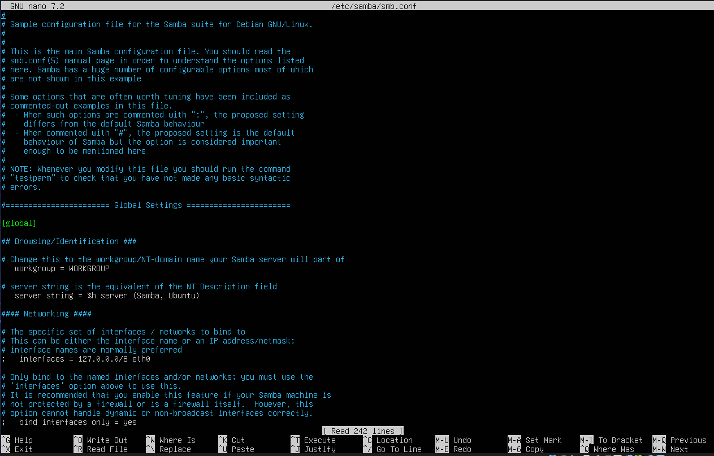
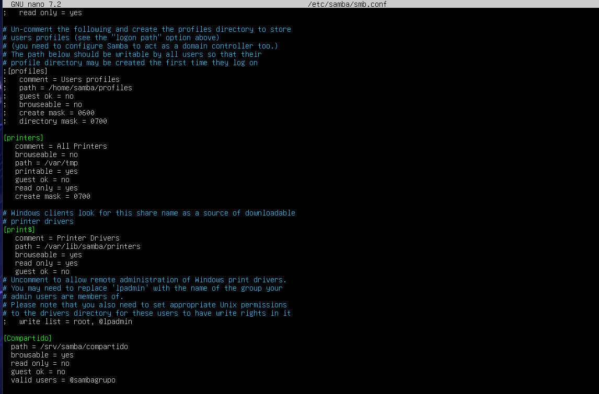

# 🖥️ Servidor de Archivos Centralizado con Samba

## 📑 Índice de Navegación Rápida

- [📌 Descripción del Proyecto](#-descripción-del-proyecto)
- [🎯 Objetivos Técnicos](#-objetivos-técnicos)
- [🧱 Stack Tecnológico](#-stack-tecnológico)
- [🌐 Arquitectura del Sistema](#-arquitectura-del-sistema)
- [⚙️ Fase 1: Preparación e Instalación](#-fase-1-preparación-e-instalación)
- [🛠️ Fase 2: Almacenamiento y Usuarios](#-fase-2-almacenamiento-y-usuarios)
- [📄 Fase 3: Configuración del Servicio (smb.conf)](#-fase-3-configuración-del-servicio-smbconf)
- [✅ Fase 4: Validación](#-fase-4-validación)
- [🛡️ Fase 5: Seguridad y Acceso (Firewall)](#️-fase-5-seguridad-y-acceso-firewall)
- [🔬 Fase 6: Comprobaciones desde Windows](#-fase-6-comprobaciones-desde-windows)
- [🧪 Resolución de Problemas](#-resolución-de-problemas)
- [📌 Conclusión](#-conclusión)

---

## 📌 Descripción del Proyecto

Este proyecto consiste en la implementación de un servidor de archivos centralizado utilizando Samba sobre Ubuntu Server. Permite que clientes Windows accedan a recursos compartidos en red mediante autenticación segura, replicando un entorno empresarial.

---

## 🎯 Objetivos Técnicos

- Robustez: Servicio estable sobre Linux  
- Gestión de usuarios y grupos  
- Interoperabilidad con Windows (SMB)  
- Seguridad (firewall + permisos)  
- Documentación reproducible  

---

## 🧱 Stack Tecnológico

- SO: Ubuntu Server 24.04 LTS  
- Servicio: Samba (SMB/CIFS)  
- Seguridad: UFW  
- Virtualización: VirtualBox  
- Control de versiones: Git / GitHub  

---

## 🌐 Arquitectura del Sistema

[ Cliente Windows ]
│
│ SMB (TCP 139, 445)
▼
[ Ubuntu Server ]
│
├── Firewall (UFW)
├── Permisos SGID
└── /srv/samba/compartido

---

## ⚙️ Fase 1: Preparación e Instalación

### 1.1 Comprobaciones

```bash
# Comprobar IP del servidor
ip a
# Comprobar conexión a internet
ping -c 4 8.8.8.8
# Pruebas de resolución de nombre
ping -c 4 google.com
# Comprobar puerto de Samba
ss -tulpn | grep -E ':139|:445'
```

### 1.2 Instalación

```bash
# Sincroniza información de repositorios e instala actualizaciones del sistema
sudo apt update && sudo apt upgrade -y
# Instala el software Samba
sudo apt install samba -y
# Consulta la version de Samba
smbd --version
```

## 🛠️ Fase 2: Almacenamiento y Usuarios

### 2.1 Directorios

```bash
# Creamos el directorio 'compartido' creando la ruta de golpe con '-p'
sudo mkdir -p /srv/samba/compartido
# Creamos un grupo 'sambagrupo'
sudo groupadd sambagrupo
# Asignamos propietario a sambagrupo
sudo chown :sambagrupo /srv/samba/compartido
# Asignamos los permisos
sudo chmod 2770 /srv/samba/compartido
```

### 2.2 Usuarios

```bash
# Crear usuario sin acceso a consola ni carpeta personal, vinculado al grupo
sudo useradd -M -s /sbin/nologin -G sambagrupo usuario1
# Asigna contraseña de Linux
sudo passwd usuario1
# Asigna contraseña de Samba para poder acceder desde Windows 
sudo smbpasswd -a usuario1
```

## 📄 Fase 3: Configuración del Servicio (smb.conf)

```bash
# Abrimos el archivo de configuración
sudo nano /etc/samba/smb.conf
```
> 💡 **Tip de edición:** Una vez dentro de `nano`, desplázate hasta el final del archivo con `Alt + /` para pegar el nuevo bloque.


```ini
[Compartido]
   path = /srv/samba/compartido
   browsable = yes
   read only = no
   guest ok = no
   valid users = @sambagrupo
   directory mask = 2770
   create mask = 0660
```

**Agregamos este bloque al final del todo**


**Guardamos y aplicamos cambios**
Ctrl + O
ENTER
Ctrl + X

## ✅ Fase 4: Validación

```bash
# Comprobamos que no haya errores
testparm
# Output: Loaded services file ok.
```
```bash
# Detiene y vuelve a arrancar los servicios
sudo systemctl restart smbd nmbd
# Output: Si todo bien, no devuelve nada
```
```bash
# Comprobamos
sudo systemctl status smbd nmbd
# Output: Active: active (running)
```

## 🛡️ Fase 5: Seguridad y Acceso (Firewall)

```bash
# Habilitar tráfico de red necesario en el Firewall
sudo ufw allow samba
# Output: Rule add, Rule add (v6)
```
```bash
# Verificamos cambios
sudo ufw status
# Output: Status: Active
# Output: Samba ALLOW (Anywhere)
```

## 🔬 Fase 6: Comprobaciones desde Windows

**Abrimos el explorador de Windows**
Escribe la ruta: `\\IP_DEL_SERVIDOR\Compartido` en el explorador

## 🧪 Resolución de Problemas

| Problema          | Causa              | Solución                           |
| ----------------- | ------------------ | ---------------------------------- |
| Timeout           | Firewall           | `sudo ufw allow samba`             |
| Acceso denegado   | Permisos           | `chmod 2770 /srv/samba/compartido` |
| Usuario no válido | No existe en Samba | `smbpasswd -a usuario`             |
| No aparece en red | nmbd parado        | `systemctl restart nmbd`           |

## 📌 Conclusión

Despliegue de un servidor Samba con control de acceso, herencia de permisos (SGID) y seguridad básica.
