# 🖥️ Servidor Nginx con Virtual Host y HTTPS

## Índice 📑

---

### 📂 Información General
* [[#Descripción 📖|01. Descripción del Proyecto]]
* [[#Objetivos 🎯|02. Objetivos Principales]]
* [[#Entorno de trabajo 🖥️|03. Entorno de Trabajo (Servidor / Cliente)]]
* [[#Arquitectura del proyecto 🏗️|04. Arquitectura y Flujo de Red]]

### 🛠️ Despliegue y Configuración Paso a Paso
* **Fase 1: Preparación del Sistema**
	* [[#1. Actualización del sistema 🔄|1. Actualización del sistema]]
	* [[#2. Instalación de Nginx 📦|2. Instalación de Nginx]]
	* [[#3. Verificación del servicio ⚙️|3. Verificación del servicio]]
	* [[#4. Comprobar la configuración 🔍|4. Comprobar la configuración de sintaxis]]
	* [[#5. Identificar la IP del servidor 🌐|5. Identificación de la IP del servidor]]
* **Fase 2: Estructura Web y Servidor Virtual**
	* [[#6. Creación de la estructura web 📁|6. Creación del directorio raíz]]
	* [[#7. Crear la página web 🌍|7. Creación del archivo index.html]]
	* [[#8. Configuración del Virtual Host 🏠|8. Configuración del bloque de servidor Nginx]]
	* [[#9. Activar el sitio 🔗|9. Activación del sitio (Enlace simbólico)]]
* **Fase 3: Seguridad y Firewall**
	* [[#10. Configuración SSL 🔒|10. Generación del certificado SSL autofirmado]]
	* [[#11. Reiniciar Nginx 🔄|11. Aplicación de cambios en Nginx]]
	* [[#12. Comprobar HTTPS localmente ✅|12. Verificación local de HTTPS (curl)]]
	* [[#13. Comprobar puerto HTTPS 🌐|13. Comprobar sockets de escucha del puerto 443]]
	* [[#14. Configuración del Firewall 🛡️|14. Apertura de reglas en el Firewall UFW]]
* **Fase 4: Integración con el Cliente y Pruebas**
	* [[#15. Configuración del cliente Windows 💻|15. Configuración del archivo hosts de Windows]]
	* [[#16. Pruebas de conectividad 📡|16. Auditoría y pruebas de conectividad final]]
	* [[#17. Advertencia SSL esperada ⚠️|17. Análisis de la advertencia SSL del navegador]]
	* [[#18. Monitorización y logs 📊|18. Gestión y lectura de logs (Access & Error)]]

### 🏁 Cierre del Proyecto
* [[#Estructura final 📂|05. Árbol de la Estructura Final de Archivos]]
* [[#Mejoras futuras 🚀|06. Líneas de Mejoras Futuras]]
* [[#Conclusiones 📝|07. Conclusiones Finales]]

---
## Descripción 📖

En este proyecto se despliega un servidor web Nginx sobre Ubuntu Server, configurando un Virtual Host accesible mediante un dominio local personalizado. Además, se implementa HTTPS utilizando un certificado SSL autofirmado y se configura la resolución de nombres desde un equipo Windows mediante el archivo `hosts`.

---

## Objetivos 🎯

- Instalar y configurar Nginx.
    
- Crear un Virtual Host.
    
- Implementar HTTPS con SSL.
    
- Configurar la redirección HTTP → HTTPS.
    
- Resolver un dominio local mediante el archivo `hosts`.
    
- Comprobar el funcionamiento del servicio.
    
- Analizar logs y conectividad.
    
- Configurar el firewall UFW.
    

---

## Entorno de trabajo 🖥️

### Servidor

|Elemento|Valor|
|---|---|
|**Sistema Operativo**|Ubuntu Server|
|**Servidor Web**|Nginx|
|**Dominio Local**|midominio.local|
|**Puerto HTTP**|80|
|**Puerto HTTPS**|443|

### Cliente

|Elemento|Valor|
|---|---|
|**Sistema Operativo**|Windows|
|**Resolución DNS**|Archivo hosts|

---

## Arquitectura del proyecto 🏗️

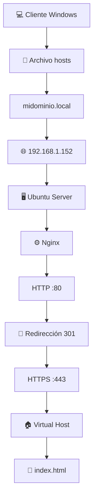

---

## 1. Actualización del sistema 🔄

Actualizar repositorios e instalar las últimas actualizaciones disponibles.

```bash
sudo apt update && sudo apt upgrade -y
```

### Verificación

Este comando muestra los paquetes que tienen actualizaciones disponibles. Si no aparece ningún resultado, significa que el sistema está completamente actualizado.

```bash
apt list --upgradable
```

---

## 2. Instalación de Nginx 📦

Instalación del servidor web.

```bash
sudo apt install nginx -y
```

### Comprobar instalación

Muestra la versión instalada de Nginx

```bash
nginx -v
```

---

## 3. Verificación del servicio ⚙️

Comprobar que Nginx se encuentra en ejecución.

```bash
systemctl status nginx
```
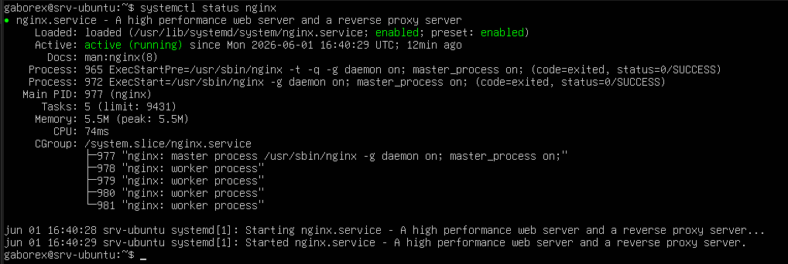
Si todo bien, verás: **Active running**
### Reiniciar servicio

Reinicia el servicio Nginx.

```bash
sudo systemctl restart nginx
```

### Recargar configuración

Recarga la configuración de Nginx sin detener el servicio.

```bash
sudo systemctl reload nginx
```

---

## 4. Comprobar la configuración 🔍

Verificar posibles errores de sintaxis.

```bash
sudo nginx -t
```

### Resultado esperado

```text
syntax is ok
test is successful
```

---

## 5. Identificar la IP del servidor 🌐

Muestra la configuración de las interfaces de red del sistema.

```bash
ip a
```
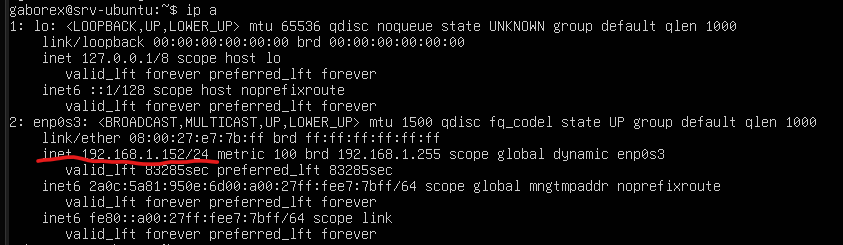

### Anotar la dirección IPv4 utilizada por el servidor

Ejemplo:

```text
192.168.1.152
```

---

## 6. Creación de la estructura web 📁

### Crear directorio

Crea la estructura de directorios indicada para alojar un sitio web.

```bash
sudo mkdir -p /var/www/midominio.local/html
```

### Asignar propietario

Cambia el propietario y el grupo de la carpeta **midominio.local** y de todo su contenido al usuario actual.

```bash
sudo chown -R gaborex:gaborex /var/www/midominio.local
```

### Configurar permisos

Cambia los permisos de la carpeta **midominio.local** y de todo su contenido.

```bash
sudo chmod -R 755 /var/www/midominio.local
```

### Verificar permisos

Muestra el contenido del directorio **html** con información detallada de cada archivo y carpeta.

```bash
ls -l /var/www/midominio.local/html
```
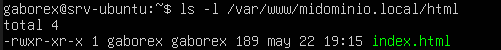


---

## 7. Crear la página web 🌍

### Crear archivo

Crea un archivo vacío llamado **index.html** en el directorio indicado.

```bash
touch /var/www/midominio.local/html/index.html
```

### Editar contenido

Abre el archivo **index.html** con el editor de Nano para poder editarlo.

```bash
nano /var/www/midominio.local/html/index.html
```

### Ejemplo de página web HTML básica

```html
<!DOCTYPE html>
<html>
<head>
    <title>Servidor Nginx ASIR</title>
</head>
<body>
    <h1>Nginx HTTPS funcionando correctamente</h1>
    <p>Proyecto ASIR - Nginx con Virtual Host</p>
</body>
</html>
```
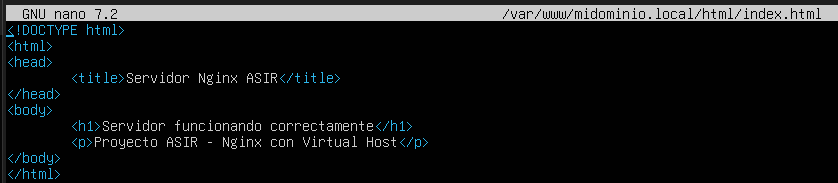


---

## 8. Configuración del Virtual Host 🏠

### Crear archivo de configuración

Abre (o crea) un archivo de configuración de Nginx para el sitio web **midominio.local** usando el editor Nano con permisos de administrador.

```bash
sudo nano /etc/nginx/sites-available/midominio.local
```

### Configuración completa

```nginx
server {
    listen 80;
    server_name midominio.local;

    return 301 https://$host$request_uri;
}

server {
    listen 443 ssl;
    server_name midominio.local;

    root /var/www/midominio.local/html;
    index index.html;

    ssl_certificate /etc/nginx/ssl/midominio.local.crt;
    ssl_certificate_key /etc/nginx/ssl/midominio.local.key;

    location / {
        try_files $uri $uri/ =404;
    }
}
```
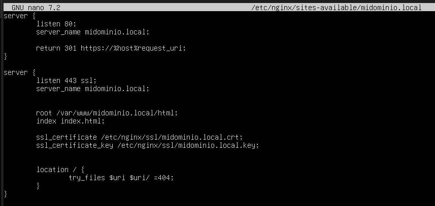

### Explicación de las directivas

#### listen 80 -> Escucha peticiones HTTP en el puerto 80.

#### return 301 -> Redirección permanente de HTTP a HTTPS.

#### listen 443 ssl -> Activa HTTPS sobre el puerto 443.

#### root -> Define la ruta donde se encuentra la web.

#### index -> Archivo principal cargado por defecto.

#### ssl_certificate -> Certificado SSL utilizado.

#### ssl_certificate_key -> Clave privada asociada al certificado.

#### try_files -> Comprueba la existencia del recurso solicitado.

---

## 9. Activar el sitio 🔗

Crea un enlace simbólico para activar el sitio web **midominio.local** en Nginx.

```bash
sudo ln -s /etc/nginx/sites-available/midominio.local /etc/nginx/sites-enabled/
```

### Verificar

Muestra los sitios web habilitados en Nginx junto con información detallada.

```bash
ls -l /etc/nginx/sites-enabled/
```

---

## 10. Configuración SSL 🔒

### Crear directorio

Crea el directorio **/etc/nginx/ssl** para almacenar certificados y claves SSL/TLS de Nginx.

```bash
sudo mkdir -p /etc/nginx/ssl
```

### Generar certificado autofirmado

Genera un ceertificado SSL/TLS autofirmado y su clave privada para habilitar HTTPS en Nginx.

```bash
sudo openssl req -x509 -nodes -days 365 -newkey rsa:2048 \
-keyout /etc/nginx/ssl/midominio.local.key \
-out /etc/nginx/ssl/midominio.local.crt
```

### Datos utilizados

|Campo|Valor|
|---|---|
|**Country Name**|ES|
|**Organization**|ASIR|
|**Common Name**|midominio.local|

### Verificar certificados

Muestra el contenido del directorio **/etc/nginx/ssl** con información detallada de los certificados y claves SSL/TLS almacenados allí.

```bash
ls -l /etc/nginx/ssl
```
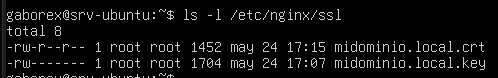

**Los certificados SSL se han creado con éxito y están protegidos de forma segura**.

---

## 11. Reiniciar Nginx 🔄

Reinicia el servicio Nginx para aplicar cambios en su configuración.

```bash
sudo systemctl restart nginx
```

---

## 12. Comprobar HTTPS localmente ✅

Realiza una petición HTTPS al propio servidor (localhost) y muestra la respuesta en la terminal.

```bash
curl -k https://localhost
```

### Resultado esperado

```html
<!DOCTYPE html>
<html>
<head>
    <title>Servidor Nginx ASIR</title>
</head>
<body>
    <h1>Nginx HTTPS funcionando correctamente</h1>
    <p>Proyecto ASIR - Nginx con Virtual Host</p>
</body>
</html>
```

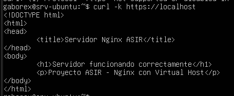


---

## 13. Comprobar puerto HTTPS 🌐

Comprueba si hay algún servicio escuchando en el puerto 443 (HTTPS).

```bash
ss -tuln | grep 443
```

### Resultado esperado

```text
LISTEN 0 511 *:443
```
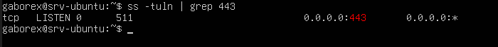

---

## 14. Configuración del Firewall 🛡️

### Estado actual

Muestra el estado del cortafuegos UFW (Uncomplicated Firewall) y las reglas configuradas.

```bash
sudo ufw status
```

### Ejemplo de salida
```Plaintext
Status: active  
  
To Action From  
-- ------ ----  
22/tcp ALLOW Anywhere  
80/tcp ALLOW Anywhere  
443/tcp ALLOW Anywhere
```

### Permitir tráfico web

Permite el tráfico HTTP y HTTPS  a través del cortafuegos UFW.

```bash
sudo ufw allow 'Nginx Full'
```

### Verificar reglas

Muestra el estado actual del firewall UFW y las reglas configuradas.

```bash
sudo ufw status
```
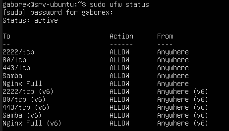

---

## 15. Configuración del cliente Windows 💻

### Editar archivo hosts

En el explorador de Windows buscamos esta ruta:

```text
C:\Windows\System32\drivers\etc\hosts
```


### Abrimos en el block de notas el archivo **hosts** y escribimos al final

```text
192.168.1.152 midominio.local
```
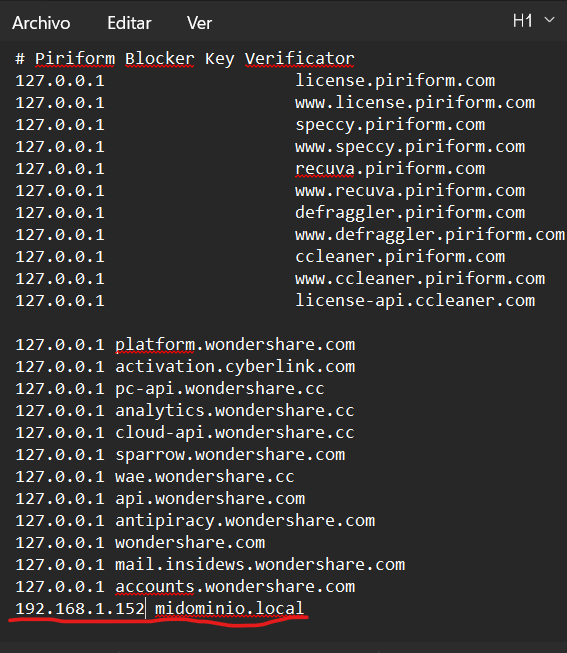

⚠️ Nota: Para editar este archivo tenemos que abrir el "block de notas" en modo administrador.

---

## 16. Pruebas de conectividad 📡

### Resolver dominio

Envía paquetes de prueba al host **midominio.local** para comprobar si es accesible por red y si la resolución de nombres funciona correctamente.

```cmd
ping midominio.local
```

⚠️ Nota: Realizar esta prueba desde el CMD o PowerShell de Windows
### Resultado esperado

```text
Respuesta desde 192.168.1.152
```
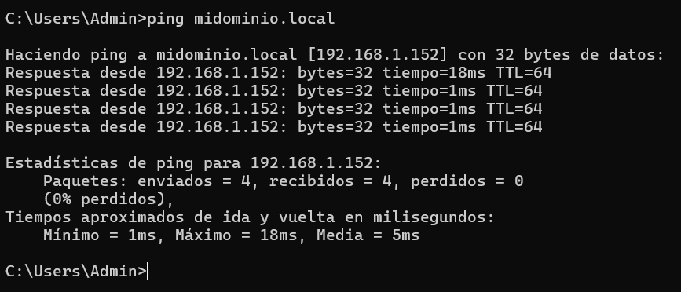

### Comprobar acceso HTTP

Desde el navegador de Windows

```text
http://midominio.local
```
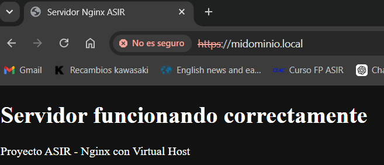

Debe redirigir automáticamente a HTTPS.

### Comprobar acceso HTTPS

Desde el navegador de Windows

```text
https://midominio.local
```

Se debe ver igualmente

---

## 17. Advertencia SSL esperada ⚠️

### Error

```text
NET::ERR_CERT_AUTHORITY_INVALID
```


### Motivo

El certificado utilizado es autofirmado y no está emitido por una autoridad certificadora reconocida.

---

## 18. Monitorización y logs 📊

### Access Log

Muestra en tiempo real las nuevas entradas del registro de accesos de Nginx.
¿Quién entra y qué está viendo?

```bash
sudo tail -f /var/log/nginx/access.log
```

### Error Log

Muestra en tiempo real los errores y advertencias registrados por Nginx.
¿Qué se ha roto y por qué no funciona?

```bash
sudo tail -f /var/log/nginx/error.log
```

---

## Estructura final 📂

```text
/var/www/midominio.local/
└── html
    └── index.html

/etc/nginx/
├── sites-available
│   └── midominio.local
├── sites-enabled
│   └── midominio.local
└── ssl
    ├── midominio.local.crt
    └── midominio.local.key
```

---

## Mejoras futuras 🚀

- Añadir un segundo Virtual Host.
    
- Crear una página de error 404 personalizada.
    
- Implementar compresión Gzip.
    
- Configurar cabeceras de seguridad.
    
- Utilizar certificados emitidos por una CA propia.
    
- Automatizar el despliegue mediante Ansible.
    
- Implementar HTTPS con Let's Encrypt en un entorno real.
    

---

## Conclusiones 📝

Durante este proyecto se ha desplegado correctamente un servidor web Nginx sobre Ubuntu Server, configurando un Virtual Host accesible mediante un dominio local personalizado. Se ha implementado HTTPS utilizando un certificado SSL autofirmado y se ha configurado una redirección automática desde HTTP hacia HTTPS.

Además, se ha realizado la resolución de nombres mediante el archivo `hosts` de Windows, permitiendo el acceso al sitio utilizando un nombre de dominio local. Finalmente, se han verificado los servicios, la conectividad de red, el funcionamiento del firewall y los registros de actividad del servidor, garantizando el correcto funcionamiento de la infraestructura desplegada.